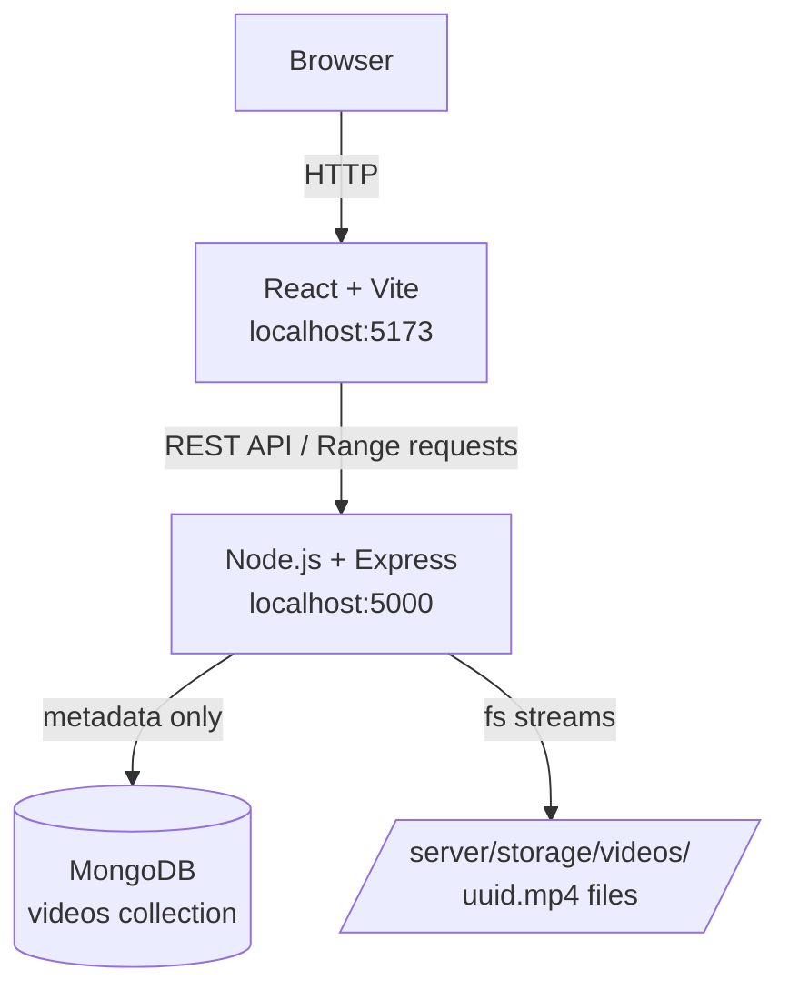
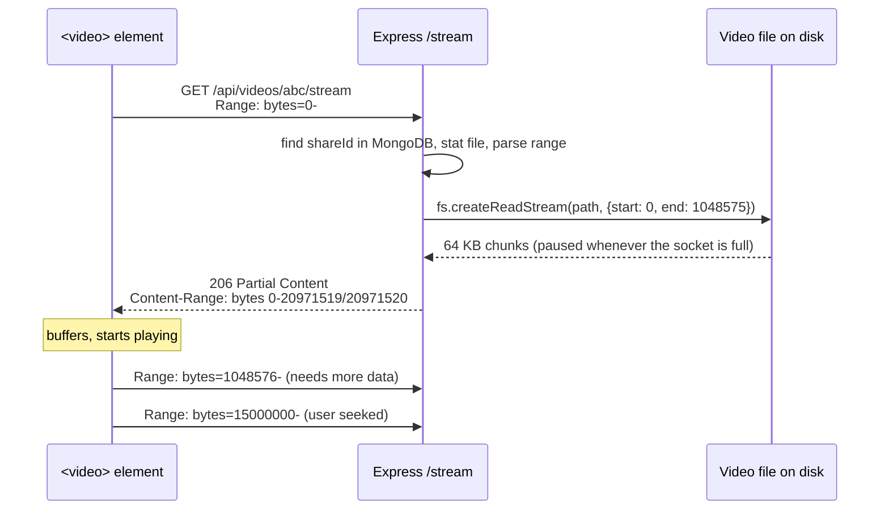

# Strivo: your home movie server for the TV (a system-design learning project)

Strivo is a small MERN app. Upload movies and series from your laptop or phone, then watch them on your TV's browser over home Wi-Fi. You type one short address once, then pick videos with the remote's arrow keys. It is not a YouTube clone. It exists to show, in code you can read in an afternoon, how you:

- accept uploads of **any size** without holding them in RAM
- **stream** video with **HTTP Range Requests** (`206 Partial Content`)
- let the **browser** do buffering and seeking
- keep **100 viewers** from taking down a small server

Everything is free and open source and runs locally. You need no cloud account and no API key.

---

## Quick start: watch on your TV

1. **Start the server on the laptop** from the project root:
   ```bash
   npm install
   npm start          # builds the web app and serves everything on port 5000
   ```
   It prints the address to use on other devices, for example:
   ```
   [server] on your TV / phone:   http://192.168.1.5:5000
   ```
2. **Let the TV reach the laptop (one-time Windows setup).**
   - Set your home Wi-Fi to **Private**: Settings → Network & Internet → Wi-Fi → (your network) → Network profile type → Private. On a *Public* network, Windows blocks all incoming connections.
   - Allow port 5000 on private networks. Run this once in an **Administrator** PowerShell:
     ```powershell
     New-NetFirewallRule -DisplayName "Strivo (port 5000)" -Direction Inbound -Protocol TCP -LocalPort 5000 -Action Allow -Profile Private
     ```
3. **Upload** from your phone or laptop (same Wi-Fi): open `http://192.168.1.5:5000/upload` and pick one or more files, such as a whole season. Keep the page open and the phone screen on until the uploads finish.
4. **Watch on the TV:** open the TV's browser, type `192.168.1.5:5000` once and **bookmark it**. After that you just choose videos from the library:

   | Remote key | Library | Player |
   |---|---|---|
   | Arrow keys | move between tiles | ◀ ▶ skip 10 s |
   | OK | open video | play / pause |
   | Back | browser back | back to library |

   The player starts on its own and **resumes where you stopped**.

**Tips**
- Keep the laptop plugged in, and stop it sleeping while you watch (Settings → System → Power → Screen and sleep → *Never* when plugged in).
- Your router may give the laptop a different address next time. If the bookmark stops working, check the address the server prints. Reserving a fixed IP (DHCP reservation) in the router settings fixes this permanently.
- Want an even shorter address? Set `PORT=80` in `server/.env`, then the TV address is just `192.168.1.5`. Allow port 80 in the firewall command instead of 5000.

---

## 1. What the application does

There are three screens:

| Library `/` (TV) | Upload `/upload` (phone/laptop) | Watch `/watch/<id>` |
|---|---|---|
| Big tiles for every movie and episode, sorted naturally (S01E2 before S01E10), with conversion progress | Pick one or many files, per-file progress bars | Plays via HTTP Range streaming, remote-friendly keys, resume position, Download button |

**Formats accepted (video only):** `.mp4 .m4v .mov .3gp .3g2 .webm .mkv .ogv .avi .wmv .asf .flv .mpg .mpeg .ts .mts .m2ts .vob .divx .f4v .ogm .rm .rmvb`. By default there is **no size limit**. Audio-only files are rejected, because this is a video app.

**Audio inside videos: every format.** AAC and MP3 are kept. Everything else ffmpeg can decode is converted to stereo AAC 192 kbps, and a test checks each of these with a real file: AC3 (Dolby Digital), E-AC3 (DD+), DTS, TrueHD, FLAC, Opus, Vorbis, PCM 16/24-bit, MP2, WMA, ALAC, ADPCM and AMR. With several audio tracks (dual-audio movies), the track the file marks as **default** is kept.

**Subtitles inside videos.** Text subtitle tracks (SRT, ASS/SSA, MP4 text, WebVTT) are extracted to WebVTT in the same ffmpeg pass as the conversion, keeping their language and title. The player has a **CC Subtitles: Off / English / …** button (or the `S` key), and your choice is remembered per device. Simple TV mode has Off/language links that need no JavaScript. Picture-based subtitles (Blu-ray PGS, DVD VobSub) can't be turned into text without OCR, so they're skipped. Subtitles are only extracted at upload, so to get them for an older upload, upload it again.

**Fullscreen.** A **⛶ Fullscreen** button (or `F`) works in old and new browsers (`webkitRequestFullscreen` and similar), and subtitles keep showing in fullscreen. In simple TV mode a tiny optional ES5 script adds the button; without it the page still works.

**Automatic conversion for the TV.** TV and phone browsers reliably play only **H.264 video + AAC/MP3 audio in MP4**. Downloaded movies often use MKV, AVI, HEVC, XviD, AC3 or DTS, which in a TV browser means a black screen or no sound. After upload the server checks each file with **ffprobe** and, if needed, converts it with **ffmpeg** (bundled via npm, free and open source):

| Upload contains | What happens | Time |
|---|---|---|
| H.264 + AAC/MP3 in MP4/MOV | nothing, ready immediately | instant |
| H.264 video, other container (MKV/TS/AVI) | video **copied**, repackaged as MP4 | seconds |
| H.264 video + AC3/E-AC3/DTS/TrueHD/FLAC/Opus/Vorbis/PCM/MP2/WMA/ALAC/AMR audio | video copied, audio re-encoded to AAC | a minute or two |
| An MP4 that already plays but has subtitle tracks | video file kept; only subtitles extracted (`-copyts` keeps them in sync) | seconds |
| HEVC, 10-bit, XviD/DivX, MPEG-2, VP9, WMV, … | full re-encode to H.264 (`libx264 -preset veryfast -crf 22`) | can take a while for a full movie |

Conversions run **one at a time** in a tiny in-memory queue (ffmpeg uses every CPU core). The library shows *Converting 42%*. The original file is deleted only after the MP4 is safely written. If the server stops mid-conversion, the job restarts from the original on the next start. Set `TRANSCODE_ENABLED=false` to keep files exactly as uploaded.

**Privacy model:** anyone on your home Wi-Fi can open the library and watch. The server is not exposed to the internet. Deleting needs the **delete token**, which is remembered only on the device that uploaded the video, so the Delete button appears only there.

## 2. Architecture



Streaming path:



## 3. Folder structure

```
Strivo/
├── package.json              # npm workspaces: `npm install` / `npm run dev` at the root
├── client/
│   ├── index.html
│   ├── vite.config.js
│   ├── .env.example
│   └── src/
│       ├── main.jsx          # React entry + router
│       ├── App.jsx           # routes: /  and  /watch/:shareId
│       ├── index.css         # plain CSS
│       ├── components/       # ProgressBar
│       ├── pages/            # LibraryPage (TV home), UploadPage, WatchPage
│       └── services/api.js   # fetch/XHR calls, stream URL, delete tokens, resume position
└── server/
    ├── .env.example
    ├── storage/videos/       # the video files (never served directly)
    ├── tests/videos.test.js
    └── src/
        ├── server.js         # connect DB, start HTTP server
        ├── app.js            # build Express app (helmet, cors, routes, errors)
        ├── config.js         # validated env vars
        ├── cleanup.js        # `npm run cleanup` entry
        ├── controllers/videoController.js   # upload / metadata / STREAM / delete
        ├── models/Video.js
        ├── routes/videoRoutes.js
        ├── middleware/       # upload (multer), validate, rateLimiters, streamSlots, errorHandler
        ├── services/         # storageService (safe paths), cleanupService (orphans), db,
        │                     # transcodeService (ffprobe/ffmpeg), conversionQueue (one job at a time)
        └── utils/            # range parser, ids, file signatures, concurrency limiter, AppError
```

## 4. How upload works

```
<input type=file> → XHR multipart POST (progress events) → rate limiter
  → disk-space guard: Content-Length + MIN_FREE_DISK_MB > free space?  → 507
  → multer fileFilter: extension on the allow-list?   (before any byte is written)
  → diskStorage: stream to storage/videos/<random-uuid>.<ext>   (optional MAX_VIDEO_SIZE_MB → 413)
  → controller: read the first bytes, do they match that container (ftyp, EBML, RIFF/AVI, OggS, ...)?
  → insert metadata in MongoDB → 201 { video, shareUrl, deleteToken }
```

- **Never in RAM.** Multer's `diskStorage` writes each incoming chunk to disk as it arrives, so memory use stays small whether the file is 5 MB or 50 GB. A test uploads a real 1 GB+ file and checks that server memory barely grows.
- **Browser MIME type is ignored.** The format comes from the extension and is verified against the file's magic bytes. Browsers often send an empty type for `.mkv`/`.avi`/`.ts`, and the type is client-controlled anyway.
- **No size cap, but disk is protected.** Without a cap, one huge upload could fill the disk and take MongoDB and the OS down with it. The disk-space guard refuses an upload up front if it would leave less than `MIN_FREE_DISK_MB` free.
- **Consistency.** The file is written first and the DB record created last. If the signature check or the DB insert fails, the controller deletes the file. If the client disconnects or goes over the size limit halfway, multer deletes the partial file itself. So the DB never points at a missing file.
- **Leftovers after a crash.** If the server is killed mid-upload, `cleanupOrphans()` removes the file. It runs on every server start, and you can also run it with `npm run cleanup`. It only deletes unreferenced files older than 2 hours, so it can't delete an upload that is still in progress. It also removes DB records whose file has disappeared.
- **XHR, not fetch.** `fetch()` can't report upload progress. `XMLHttpRequest.upload.onprogress` can.

## 5. How streaming works

The whole stream handler is `streamVideo` in `server/src/controllers/videoController.js`, and the range parser is `server/src/utils/range.js`. See [Streaming, line by line](#streaming-line-by-line) below.

The key points:

1. The client only ever sends a **shareId**. The server looks up `storedName` in MongoDB and builds the path itself.
2. The server reads the `Range` header and answers **206** with only those bytes.
3. The bytes come from `fs.createReadStream(path, { start, end })`, which reads 64 KB at a time.
4. `pipeline()` connects file → socket with **backpressure**, so it never reads faster than the viewer downloads.

## 6. How HTTP Range Requests work

A Range request asks for part of a resource:

```http
GET /api/videos/UX_moABTzeRvBseKmfnrOw/stream
Range: bytes=0-1048575
```

```http
HTTP/1.1 206 Partial Content
Accept-Ranges: bytes                         ← "you may ask me for ranges"
Content-Range: bytes 0-1048575/20971520      ← which bytes these are / total size
Content-Length: 1048576                      ← size of THIS response
Content-Type: video/mp4
```

| Request `Range` | Meaning | Our response |
|---|---|---|
| `bytes=0-1048575` | first 1 MB | 206, exactly that |
| `bytes=5000000-` | from 5 MB to the end | 206, everything to the end (optionally capped by `STREAM_CHUNK_SIZE_MB`) |
| `bytes=-500` | last 500 bytes (players use this to find the MP4 index) | 206 |
| `bytes=999999999-` | past the end of the file | **416** + `Content-Range: bytes */size` |
| `pages=1-2`, `bytes=0-1,5-9` | malformed / multi-range | **416** (multi-range deliberately unsupported) |
| *(none)* | e.g. `curl` | 200, whole file, still streamed |

**Should open-ended ranges be capped?** Browsers usually ask for `bytes=0-` ("everything"). There are two options:

- **No cap (the default).** Send everything up to the end of the file. The stream still reads only as fast as the viewer downloads (backpressure), so RAM stays flat. When the viewer seeks or stops, the browser closes the connection and the stream stops. The cost is that a viewer holds one stream slot for as long as they watch.
- **Cap** (e.g. `STREAM_CHUNK_SIZE_MB=1`). Each response is short, a slot is freed within milliseconds, and modern browsers simply ask for the next range.

We tried the cap first and it **broke old TV video players**. They treat a shorter 206 answer as the *end of the video*: a 21-second, 5 MB clip stopped after the first 1 MB (about 4 seconds) and restarted. Compatibility wins for a home TV server, so there is no cap by default.

## 7. How browser buffering works

We write **no buffering code**. The page contains:

```jsx
<video controls preload="metadata" src={streamUrl} />
```

- `preload="metadata"` downloads only the first bytes (duration, size, first frame) until you press play.
- While playing, the browser keeps a few seconds to a minute of video buffered ahead of the playhead. It sends new Range requests as that buffer drains.
- When you **seek**, the browser uses the MP4 index (the `moov` box) to work out the byte offset for that time, and requests `Range: bytes=<offset>-`. The server doesn't need to know anything about time.
- Pause, fullscreen and volume are all native controls.

You can watch this happen in DevTools → Network: filter on `stream` and look for a series of `206` responses.

> **Tip:** MP4 files whose `moov` index sits at the *end* of the file make the browser fetch the tail first (`bytes=-N`) before it can play. Re-encoding with "fast start" (`ffmpeg -movflags +faststart`) moves the index to the front.

## 8. Why MongoDB doesn't store videos

- A MongoDB document is limited to **16 MB**. GridFS gets around that by splitting files into chunks, but then every Range request becomes database queries, and database RAM and cache get filled with video bytes that crowd out the metadata you actually query.
- Filesystems are built for large sequential reads, and the OS page cache already caches hot files for free.
- Backups, replication and indexes stay small and fast when the DB holds only about 300 bytes of metadata per video.
- Swapping `storage/videos/` for object storage later (MinIO, S3) only changes where the bytes come from. The metadata model stays the same.

## 9. Why streams instead of `fs.readFile()`

```js
// ❌ Loads the ENTIRE file into a Buffer before sending one byte.
const data = await fs.promises.readFile(videoPath); // 1 GB video → 1 GB of RAM, per request
res.end(data);

// ✅ Reads 64 KB at a time, only the requested range, at the pace the client downloads.
fs.createReadStream(videoPath, { start, end, highWaterMark: 64 * 1024 }).pipe(res);
```

With `readFile`, 10 viewers of a 1 GB video need about **10 GB of RAM**, and the first byte only goes out after the whole file has been read. With streams, 10 viewers need about **10 × 64 KB ≈ 640 KB**, and playback starts right away.

## 10. How concurrent viewers affect CPU, RAM, disk and network

Take "100 friends watch a 1 GB video at once":

| Resource | Cost per active stream | 100 viewers | Notes |
|---|---|---|---|
| **RAM** | ~64 KB stream buffer + socket buffers | a few MB | Constant, whatever the video size. With `readFile` it would be ~100 GB. |
| **CPU** | Very low: copying bytes, no transcoding | low | We serve the file as it is. Transcoding (HLS) would be the CPU-heavy part. |
| **Disk** | Sequential reads | OS page cache serves the popular video from RAM after the first read | Many *different* videos means more random I/O, and an SSD helps. |
| **Network** | The real bottleneck | 100 × 5 Mbps = **500 Mbps upstream** | A home connection can't do this. That's why the limits below exist. |
| **File descriptors** | 1 per open stream | 100 | Fine. OS limits are in the thousands. |

**Backpressure** is why RAM stays flat. When a viewer's connection is slow, the socket's buffer fills up and `res.write()` returns `false`. `pipeline()` then pauses the file stream until the socket emits `drain`. A slow viewer therefore makes us read the disk more slowly. It does not make unsent data pile up in memory.

**Protection layers**, from cheapest to most expensive check:

1. **Per-IP rate limits** (`express-rate-limit`, in memory), kept separate so heavy watching never blocks uploads:
   uploads 10 per 15 min · stream 300 per min · metadata/delete 100 per min → `429`
2. **Global stream cap**: `MAX_CONCURRENT_STREAMS` (default 20), a tiny in-memory semaphore (`utils/concurrencyLimiter.js`). If every slot is busy, the server answers `503` with `Retry-After` straight away instead of letting every viewer slow down. A slot is released on `res.on('close')`, which fires both when a response completes and when a viewer disconnects, so slots can't leak.
3. **Optional range cap** (`STREAM_CHUNK_SIZE_MB`, off by default for TV compatibility), so a slot is held for milliseconds rather than for the whole movie.
4. **Disk-space guard** (`MIN_FREE_DISK_MB`) → `507`, plus an **optional** size cap (`MAX_VIDEO_SIZE_MB`, off by default) → `413`, enforced *while* streaming the upload.
5. **Server limits**: `server.maxConnections = 500` and Node's `headersTimeout` (slowloris protection). The whole-request timeout is disabled (`requestTimeout = 0`), because an unlimited upload can legitimately take hours.

*Trade-off:* the semaphore rejects instead of queueing. A queue would make viewers wait silently while holding connections open. Failing fast is simpler, and the browser (or the Retry button on the watch page) tries again.

## 11. Security measures

| Threat | Mitigation |
|---|---|
| Guessing other videos' URLs | Share ID = 128 random bits (`crypto.randomBytes(16)`, base64url), not `/watch/1` |
| Path traversal (`../../etc/passwd`) | Client never sends a path or filename used on disk. The stored name is `crypto.randomUUID()` + an extension from our allow-list. `resolveVideoPath()` re-checks the name against a strict regex and confirms the path stays inside `storage/videos/`. The share ID is validated against `^[A-Za-z0-9_-]{22}$`. |
| Malicious or disguised files | Extension allow-list of 17 video containers (before writing), then a **magic-byte check** that the content matches that container (after writing). `setup.exe`, `clip.mp4.exe` and an `evil.sh` renamed to `.mp4` are all rejected, and nothing is left on disk. |
| Disk exhaustion (no size cap) | Disk-space guard answers `507` before any bytes are written |
| Direct file access | No `express.static`. `GET /storage/videos/x.mp4` returns 404. All access goes through `/stream`. |
| Anyone with the link deleting the video | `DELETE` needs the `X-Delete-Token` given only to the uploader. Only its SHA-256 hash is stored, and it's compared in constant time. |
| Resource exhaustion | Rate limits, stream semaphore, size limit, multer part/field limits, no JSON body parser |
| Cross-site calls | CORS allows only `CLIENT_URL`. Helmet sets security headers (CSP, `nosniff`, CORP `same-site` so only our own site can embed the stream). |
| Leaking internals | Central error handler returns `{ success, message }` only. No paths, no stack traces outside `development`. The metadata API never returns `storedName` or a path. |
| Bad config | `config.js` validates every env var with Zod at startup |

**Not included** (outside the scope of a small project): user accounts, expiring links, HTTPS termination (put Caddy or nginx in front for that), antivirus scanning, persistent rate-limit store for multiple servers.

### Old TV browsers

TV browsers often run an engine many years old. Each item below is a real failure seen on a TV, and how it was fixed. `npm test` checks all of them (`client/tests/tvCompatibility.test.js`):

| Symptom on the TV | Cause | Fix |
|---|---|---|
| Blank white page | Vite's output needs about Chrome 107+ | `@vitejs/plugin-legacy`, one ES5 bundle for everyone |
| `System is not defined` | The polyfill file used arrow functions / template strings (added by the bundler helper and the Oxc minifier) | terser instead of Oxc, plus a build step that converts the polyfill chunk to ES5 and **fails the build** if any file isn't ES5 |
| `Incompatible receiver, Symbol required` | Babel's `typeof` rewrite breaks core-js's Symbol polyfill | That Babel transform is excluded for core-js |
| `fetch is not defined` | Browsers before about Chrome 42 have no `fetch` | `whatwg-fetch` polyfill |
| White text on white buttons | No CSS variables before about Chrome 49 | `postcss-custom-properties` writes plain fallbacks; CSS minification off (it deleted them) |
| Video stops after about 4 s | Old players treat a capped 206 response as the end of the file | No range cap by default |

If the full app still fails on some TV, **`/tv`** is a server-rendered page with **no JavaScript at all** (plain links plus `<video>`), and the loading screen links to it.

## 12. How to run locally

**Prerequisites:** Node.js 22 or newer, and MongoDB Community Edition running on `127.0.0.1:27017`. Either:
- install it from https://www.mongodb.com/try/download/community (free), or
- if you have Docker: `docker run -d --name strivo-mongo -p 27017:27017 mongo:7`

```bash
# from the project root
npm install                                   # installs root, server and client (npm workspaces)
cp server/.env.example server/.env            # already present in this repo; edit if needed
npm start                                     # build the React app + serve everything on :5000
```

Open **http://localhost:5000** on the laptop, or the printed `http://<laptop-ip>:5000` on the TV or phone.

For development with hot reload, use `npm run dev`: API on :5000 and Vite on :5173, with `/api` proxied to the API. Vite also listens on the Wi-Fi, so `http://<laptop-ip>:5173` works from the phone.

Other commands:

```bash
npm test           # server tests; uses an in-memory MongoDB, no local Mongo needed
npm run cleanup    # remove orphan files / broken records
```

The first `npm test` downloads a MongoDB binary for `mongodb-memory-server` (about 100 MB, one time only).

Environment variables (`server/.env`):

| Variable | Default | Purpose |
|---|---|---|
| `PORT` | 5000 | API port |
| `MONGODB_URI` | `mongodb://127.0.0.1:27017/video-sharing` | |
| `CLIENT_URL` | `http://localhost:5173` | CORS origin for the Vite dev server (share URLs use the address you connected with) |
| `MAX_VIDEO_SIZE_MB` | 0 | optional upload cap; `0` = no limit (413 above it) |
| `MIN_FREE_DISK_MB` | 1024 | refuse uploads (507) that would leave less free disk than this |
| `MAX_CONCURRENT_STREAMS` | 20 | global stream slots (503 above it) |
| `STREAM_CHUNK_SIZE_MB` | 0 | max MB per range response; `0` = no cap (old TV players need this) |
| `DNS_SERVERS` | *(empty)* | optional, e.g. `8.8.8.8,1.1.1.1` (see below) |
| `TRANSCODE_ENABLED` | true | convert files TV browsers can't play to H.264/AAC MP4 |
| `FFMPEG_PATH` / `FFPROBE_PATH` | bundled | use your own ffmpeg build instead |

**MongoDB Atlas instead of a local MongoDB?** Put your `mongodb+srv://...` string in `MONGODB_URI`, and add `/video-sharing` before the `?` to name the database. If startup fails with `querySrv ECONNREFUSED`, your machine is sending Node's DNS queries to a local proxy (VPN, security agent) that refuses SRV lookups. Set `DNS_SERVERS=8.8.8.8,1.1.1.1` to fix it. Credentials are masked in all logs.

Client (optional, `client/.env`): `VITE_API_URL`, `VITE_MAX_VIDEO_SIZE_MB`.

## 13. API endpoints

| Method & path | Description | Success | Errors |
|---|---|---|---|
| `GET /api/videos` | library: all videos, natural title order | `200 { success, videos: [...] }` | 429 |
| `POST /api/videos/upload` | multipart: `video` (file), `title` (optional, ≤100 chars) | `201 { success, video, shareUrl, deleteToken }` | 400 invalid file, 413 over optional cap, 429, 507 disk full |
| `GET /api/videos/:shareId` | metadata | `200 { success, video: { id, title, originalName, size, mimeType, status, progress, createdAt } }` (`status`: processing / ready / failed) | 400 bad ID, 404, 429 |
| `GET /api/videos/:shareId/subtitles/:index` | one subtitle track as WebVTT (for `<track>`) | `200 text/vtt` | 400, 404 |
| `GET /api/videos/:shareId/stream` | video bytes, Range supported. `?download=1` adds `Content-Disposition: attachment` | `206` (or `200` without `Range`) | 404, 416, 429, 503 busy |
| `DELETE /api/videos/:shareId` | header `X-Delete-Token` | `200 { success, message }` | 401 no token, 403 wrong token, 404 |

All errors look like `{ "success": false, "message": "Video not found" }`.

## 14. Future improvements

- **HLS/DASH** for adaptive bitrate (multiple qualities), for watching over weak Wi-Fi or from outside home.
- **Picture-based subtitles** (PGS/VobSub) via OCR, or burned into the video as an option.
- **Audio language switching** during playback. Browsers can't reliably switch audio tracks, so this would mean one MP4 per language.
- **Series grouping** (seasons/episodes as folders) and thumbnails (`ffmpeg -ss 60 -frames:v 1`).
- **Hardware encoding** (`h264_nvenc`, `h264_qsv`) to make full re-encodes much faster on laptops with a GPU.
- **Object storage** (MinIO is open source and S3-compatible) with pre-signed URLs, so bytes bypass Node entirely.
- **CDN or reverse-proxy caching** (nginx `slice` module) in front of `/stream`.
- **Expiring or password-protected links**, and optional accounts.
- **Resumable uploads** (tus protocol) for flaky connections.
- **Shared rate-limit and semaphore store** (Redis) once there's more than one server.
- **Upload queue**: a concurrency limit on uploads as well, to protect disk bandwidth.

---

## Streaming, line by line

From `server/src/controllers/videoController.js`:

```js
async function streamVideo(req, res) {
```
This runs only after the per-IP **rate limiter**, **shareId validation** (`^[A-Za-z0-9_-]{22}$`) and **stream-slot acquisition** have all passed (see `routes/videoRoutes.js`). Cheap checks come first.

```js
  const video = await findVideoOr404(req.params.shareId);
```
This is a MongoDB lookup through the unique `shareId` index. It returns about 300 bytes of metadata, never video data. An unknown ID gives `404`.

```js
  const filePath = resolveVideoPath(config.storageDir, video.storedName);
```
The path is built **on the server** from our own UUID filename, never from anything the client sent. `resolveVideoPath` re-validates the name and confirms the result is still inside `storage/videos/`.

```js
  let fileSize;
  try {
    ({ size: fileSize } = await fs.promises.stat(filePath));
  } catch {
    throw new AppError(404, 'Video file is unavailable');
  }
```
`stat` reads the file's **metadata** (its size) from the filesystem. It reads **zero bytes of content**. We use the real size on disk rather than the DB value, so `Content-Range` can never lie.

```js
  res.set('Accept-Ranges', 'bytes');
```
This tells the browser "you may request byte ranges". Without it, some players won't let you seek.

```js
  const rangeHeader = req.headers.range;
  let start = 0;
  let end = fileSize - 1;
```
The default is the whole file (byte offsets are 0-based and `end` is **inclusive**, hence `- 1`).

```js
  if (rangeHeader) {
    const range = parseRange(rangeHeader, fileSize, config.streamChunkBytes);
```
`parseRange` turns `bytes=START-END`, `bytes=START-` or `bytes=-SUFFIX` into numbers, clamps `end` to the file size, and **caps** the range at 1 MB. It's pure arithmetic on a string, so still no file I/O.

```js
    if (!range) {
      res.set('Content-Range', `bytes */${fileSize}`);
      throw new AppError(416, 'Requested range not satisfiable');
    }
```
For a malformed or out-of-bounds range, the HTTP spec says reply `416` and include the real size (`*/size`), so the client can correct itself.

```js
    ({ start, end } = range);
    res.status(206);
    res.set('Content-Range', `bytes ${start}-${end}/${fileSize}`);
```
`206 Partial Content` plus `Content-Range` say "here are bytes *start* to *end* of a file that is *fileSize* bytes long". The browser uses this to place the bytes correctly in its buffer.

```js
  } else {
    res.status(200);
  }
```
If there is no `Range` header (curl, download managers), we send a normal full response, and it is still streamed below.

```js
  res.set('Content-Type', video.mimeType);
  res.set('Content-Length', String(end - start + 1));
  res.set('Cache-Control', 'private, max-age=3600');
```
- `Content-Type` comes from our validated allow-list, so the browser picks the right decoder.
- `Content-Length` is the size of **this response only** (for example 1,048,576), not the whole file. `+ 1` because `end` is inclusive.
- `private` lets the viewer's browser cache ranges but tells shared proxies not to.

```js
  if (req.method === 'HEAD') return res.end();
```
A `HEAD` request asks for headers only, so we return without opening the file at all.

```js
  const fileStream = fs.createReadStream(filePath, { start, end, highWaterMark: 64 * 1024 });
```
This is the line that keeps RAM flat. Creating the stream reads **nothing** yet. It opens a file descriptor and waits. When data is requested, it reads **at most 64 KB** (`highWaterMark`) from byte `start`, and stops exactly at byte `end`. A 1 MB range is 16 small reads, so the full video is never in memory. Compare `fs.readFile(filePath)`, which would allocate a buffer the size of the **entire** file before sending anything.

```js
  pipeline(fileStream, res, (err) => {
```
`pipeline` connects **file → HTTP response** and handles **backpressure** for us:

1. The file stream produces a 64 KB chunk, and `pipeline` writes it to `res` (the socket).
2. If the viewer's connection is slower than the disk, the socket's send buffer fills and `res.write()` returns `false`.
3. `pipeline` **pauses** the file stream. No more disk reads happen, so no data piles up in RAM.
4. When the socket drains, it emits `'drain'`, `pipeline` **resumes** the file stream, and the cycle repeats.

The reading speed automatically matches the viewer's download speed. `pipeline` (unlike a bare `.pipe()`) also **destroys the file stream and closes the file descriptor** if the viewer disconnects or seeks away mid-response, so there's no descriptor leak.

```js
    if (err && err.code !== 'ERR_STREAM_PREMATURE_CLOSE') {
      console.error(`[stream] ${video.shareId}: ${err.code ?? err.message}`);
    }
  });
}
```
When a viewer seeks, the browser **aborts** the in-flight request and starts a new one. That shows up as `ERR_STREAM_PREMATURE_CLOSE`, which is normal, so we don't log it. Anything else, such as a disk error, is logged. Headers are already sent at that point, so the only option is to close the connection, and the browser retries.

Finally, when the response ends or the viewer disconnects, `res` emits `'close'`. The `streamSlots` middleware listens for that event and **releases the concurrency slot**.

**Per-request memory, summarised:** about 300 bytes of metadata, one 64 KB read buffer and the socket buffers. The size of the video doesn't matter.
